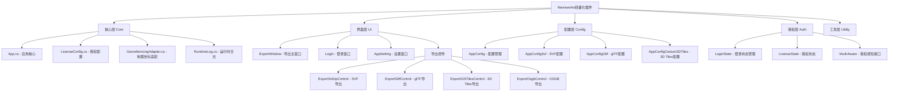
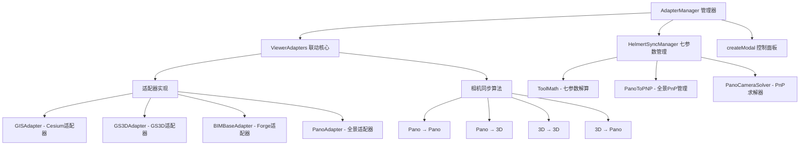
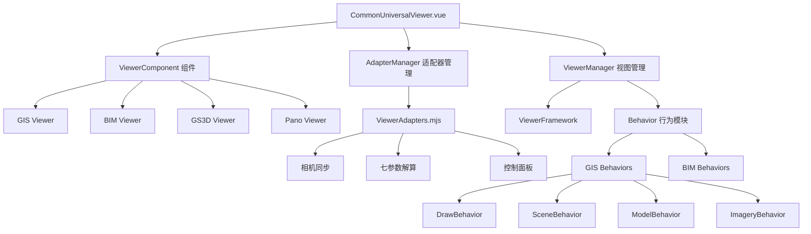
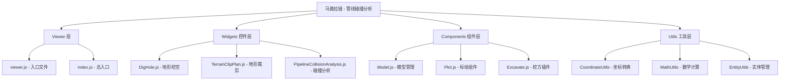
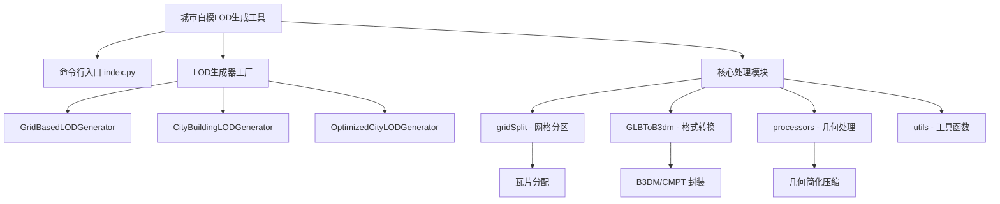
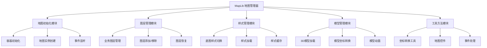
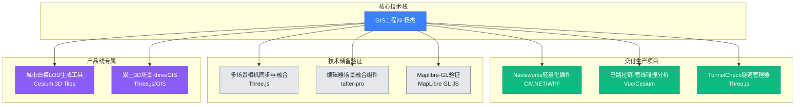

```mermaid
graph TD
    A[累土3D场景 threeGIS] --> B[Viewer 场景总控]
    B --> C[Terrain 地形模块]
    B --> D[CameraManager 相机模块]
    B --> E[ToolManager 工具管理器]
    B --> F[ModelManager 模型管理器]
    B --> G[MarkerManager 标记管理器]
    B --> H[AuxiliaryTools 辅助工具]

    C --> C1[TerrainTile 地形瓦片]
    C --> C2[TerrainEditor 地形编辑器]
    C --> C3[MultipleTerrainEditorEditor 多地形编辑器]
    C --> C4[TerrainMapAtlas 地形图集]
    C --> C5[MapDrapeLodVisualizer 影像LOD可视化]
    C --> C6[CompactionDrape 压实度叠加]
    C --> C7[CompactionMapManager 压实度图管理]

    E --> E1[MeasureToolUI 测量工具]
    E --> E2[DrawToolUI 绘制工具]
    E --> E3[TerrainEditorUI 地形修整工具]
    E --> E4[AnimationControlUI 动画控制工具]
    E --> E5[AuxiliaryToolsUI 辅助工具]
    E --> E6[TestToolsUI 测试工具]
    E --> E7[InfoManagerUI 信息面板]

    F --> F1[GLTFLoader 模型加载]
    F --> F2[Tracker 资源跟踪]
    F --> F3[animationConfig.json 动画配置]

    H --> H1[DrawTool 点线面绘制]
    H --> H2[zoomLevel 缩放级别]
```

```mermaid
graph TD
    A[TunnelManager 隧道管理器] --> B[隧道生成模块]
    A --> C[人物模型模块]
    A --> D[车辆模型模块]
    A --> E[标签管理模块]
    A --> F[道路生成模块]
    A --> G[KML解析模块]
    A --> H[工具模块]

    B --> B1[TunnelGeometryFactory - 隧道几何工厂]
    B --> B2[TunnelGeometryUtils - 隧道几何工具]
    B --> B3[ProgressMapper - 进度映射器]
    B --> B4[TunnelStageSurface - 隧道阶段表面]

    C --> C1[MakeMan - 人物模型生成]
    C --> C2[Controller - 人物控制器]

    D --> D1[MakeCar - 车辆模型生成]

    E --> E1[MakeInfoLabels - 信息标签生成]

    F --> F1[TunnelMileageHelper - 里程辅助器]

    G --> G1[KMLLoad - KML加载]
    G --> G2[KMLToThreeLine - KML转Three.js线路]
    G --> G3[KMLSegmenter - KML分段器]

    H --> H1[CameraPerpToCurveAtT - 相机工具]
    H --> H2[ResourceTracker - 资源跟踪器]
```

# 杨杰项目交接文档

## 基本信息

| 项目 | 内容 |
|------|------|
| **公司** | BIMCC |
| **职位** | GIS工程师 |
| **交接人** | 杨杰 |
| **交接时间** | 2026年3月上旬 |
| **仓库地址** | [项目地址（http://192.168.2.187/）](http://git.bimcc.site:8083/yangjie/projecthandover.git) |


---

## 项目概览

本文档详细记录了杨杰在BIMCC公司任职期间负责的主要项目，包括项目背景、技术架构、代码结构、使用说明及注意事项。

### 项目列表

<style>
.project-table {
  width: 100%;
  border-collapse: collapse;
  table-layout: fixed;
}
.project-table th, .project-table td {
  border: 1px solid #ddd;
  padding: 8px;
  word-wrap: break-word;
  overflow-wrap: break-word;
}
.project-table th:nth-child(1) {
  width: 40px;
  text-align: center;
}
.project-table th:nth-child(5) {
  max-width: 50px;
}
.project-table td:nth-child(1) {
  text-align: center;
}
.project-table td:nth-child(5) {
  max-width: 50px;
}
</style>

<table class="project-table">
<thead>
<tr>
<th>序号</th>
<th>项目名称</th>
<th>项目性质</th>
<th>项目进度状态</th>
<th>仓库地址</th>
<th>项目对接人/合作人</th>
</tr>
</thead>
<tbody>
<tr>
<td>1</td>
<td>Navisworks轻量化插件</td>
<td>交付生产</td>
<td>完成交付</td>
<td><a href="http://192.168.2.187:8083/cqbimcc/bimcc.navisworks.export.git">git</a></td>
<td>忠哥、黄银银</td>
</tr>
<tr>
<td>2</td>
<td>多场景相机同步与融合</td>
<td>技术储备验证</td>
<td>验证测试完成</td>
<td><a href="http://192.168.2.187:8083/huangxukai/modeladapters.git">git</a></td>
<td>秦梦媛、廖总、黄旭凯</td>
</tr>
<tr>
<td>3</td>
<td>编辑器场景融合组件</td>
<td>技术储备验证</td>
<td>验证测试完成</td>
<td><span title="test分支：rafter-pro\packages\page-business-components\components\universalViewer">rafter-pro</span></td>
<td>秦梦媛、廖总</td>
</tr>
<tr>
<td>4</td>
<td>马路拉链（管线碰撞分析）</td>
<td>交付生产</td>
<td>交付完成</td>
<td><a href="http://192.168.2.187:8083/bimccfe/viewer-pipenetwork">git</a></td>
<td>冉总、廖大哥、黄银银</td>
</tr>
<tr>
<td>5</td>
<td>城市白模LOD生成工具</td>
<td>交付生产/储备</td>
<td>交互完成（城市白模数据）</td>
<td><a href="http://192.168.2.187:8083/yangjie/building3dtileslod.git">git</a></td>
<td>秦梦媛、忠哥</td>
</tr>
<tr>
<td>6</td>
<td>累土3D场景、threeGIS</td>
<td>产品线专属</td>
<td>进行时：场景具备一定应用潜力，但产品功能清单不明确</td>
<td><a href="http://192.168.2.187:8083/yangjie/threegis.git">git</a></td>
<td>曾总、黄银银</td>
</tr>
<tr>
<td>7</td>
<td>TunnelCheck 隧道生成管理器</td>
<td>交付生产</td>
<td>交付完成</td>
<td><a href="http://192.168.2.187:8083/yangjie/tunnelcheck.git">git</a></td>
<td>蒲总、秦梦媛、卢炜杰、万元满</td>
</tr>
<tr>
<td>8</td>
<td>Maplibre-GL验证</td>
<td>技术储备验证</td>
<td>测试验证完成</td>
<td><a href="http://192.168.2.187:8083/yangjie/maplibre-gl-check.git">git</a></td>
<td>廖总、黄银银</td>
</tr>
</tbody>
</table>

---

## 项目详细说明

### 1. Navisworks轻量化插件

#### 项目概述

Navisworks轻量化插件是一款基于Autodesk Navisworks平台的BIM模型轻量化转换工具。该插件能够将Navisworks中的BIM模型（NWD/NWF/NWC/RVT格式）转换为多种轻量化格式，便于在Web端、移动端进行模型浏览和协作。

**技术栈**：
- C# / .NET Framework 4.8
- WPF (Windows Presentation Foundation)
- Autodesk Navisworks API
- Bimangle.ForgeEngine.Navisworks SDK

#### 项目仓库地址

http://192.168.2.187:8083/cqbimcc/bimcc.navisworks.export  
http://git.bimcc.site:8083/cqbimcc/bimcc.navisworks.export.git


#### 技术架构



#### 项目结构


```
BIMCC.Navisworks.Export/
├── Auth/                          # 授权模块
│   ├── IAuthAware.cs              # 授权感知接口
│   ├── LicenseState.cs            # 授权状态
│   └── LoginState.cs              # 登录状态管理
├── Config/                        # 配置模块
│   ├── AppConfig.cs               # 应用配置主类
│   ├── AppConfigCesium3DTiles.cs  # Cesium 3D Tiles配置
│   ├── AppConfigGltf.cs           # glTF配置
│   ├── AppConfigManager.cs        # 配置管理器
│   └── AppConfigSvf.cs            # SVF配置
├── Core/                          # 核心模块
│   ├── App.cs                     # 应用核心逻辑
│   ├── AssemblyResolve.cs         # 程序集解析
│   ├── GeoreferncingAdapter.cs    # 地理坐标适配器
│   ├── LicenseConfig.cs           # 授权配置
│   ├── ProjValidator.cs           # 投影验证
│   └── RuntimeLog.cs              # 运行时日志
├── Helpers/                       # 辅助工具
│   ├── ProgressExHelper.cs        # 进度条辅助
│   ├── FormProgressEx.cs          # 进度窗体
│   └── ProgressWindow.xaml        # 进度窗口
├── UI/                            # 用户界面
│   ├── Controls/                  # 导出控件
│   │   ├── ExportSvfzipControl    # SVF导出控件
│   │   ├── ExportGltfControl      # glTF导出控件
│   │   ├── ExportGISTilesControl  # 3D Tiles导出控件
│   │   ├── ExportOsgbControl      # OSGB导出控件
│   │   └── IExportControl.cs      # 导出控件接口
│   ├── ExportWindow.xaml          # 导出主窗口
│   ├── Login.xaml                 # 登录窗口
│   ├── AppSetting.xaml            # 设置窗口
│   ├── UserInfo.xaml              # 用户信息窗口
│   └── AboutUs.xaml               # 关于窗口
├── Utility/                       # 工具类
│   ├── AppHelper.cs               # 应用辅助
│   ├── PluginHelper.cs            # 插件辅助
│   ├── Tools.cs                   # 通用工具
│   └── XMLHelper.cs               # XML处理
├── Resources/                     # 资源文件
├── BIMCCExportMain.cs             # 插件入口
├── BIMCCPlugin.xaml               # Ribbon布局
└── VersionInfo.cs                 # 版本信息
```

#### 核心功能

| 功能模块 | 说明 |
|----------|------|
| **SVF导出** | 将模型导出为Autodesk SVF格式（.svfzip），支持Forge Viewer浏览 |
| **glTF导出** | 将模型导出为glTF/glb格式，支持通用3D查看器 |
| **Cesium 3D Tiles导出** | 将模型导出为Cesium 3D Tiles格式，支持GIS场景集成 |
| **OSGB导出** | 将模型导出为OSGB格式，支持倾斜摄影场景 |
| **授权管理** | 基于硬件ID的授权验证，支持试用版和正式版 |
| **用户登录** | 用户身份验证和权限控制 |
| **多版本支持** | 支持Navisworks 2014-2026多个版本 |

**导出参数配置**：
- 视觉样式：自动、彩色、贴图、真实
- 细节层次(LOD)：0-8级，支持自动设置
- 可选功能：超链接、缩略图、属性数据库、几何简化等

#### 使用说明

1. **安装插件**
   - 将编译后的DLL复制到Navisworks插件目录
   - 路径：`C:\ProgramData\Autodesk\Navisworks Manage 20xx\Plugins\BIMCC.Navisworks.Export`

2. **启动插件**
   - 打开Navisworks，加载BIM模型（NWD/NWF/NWC/RVT）
   - 在功能区找到"BIMCC"选项卡
   - 点击"导出"按钮打开导出窗口

3. **导出模型**
   - 选择导出格式（SVF/glTF/3D Tiles/OSGB）
   - 配置导出参数（视觉样式、LOD等）
   - 选择输出路径
   - 点击"导出"按钮开始转换

4. **授权管理**
   - 首次使用需要导入授权文件
   - 点击"授权管理"进行授权配置

#### 注意事项

1. **版本兼容性**
   - 项目包含多个版本的解决方案文件（2014-2026）
   - 编译时需选择对应Navisworks版本的解决方案

2. **依赖项**
   - Bimangle.ForgeEngine.Navisworks SDK（核心转换引擎）
   - Newtonsoft.Json（JSON处理）
   - RestSharp（HTTP请求）
   - SharpZipLib（压缩解压）


3. **授权机制**
   - 授权文件基于硬件ID生成
   - 授权文件路径：`C:\ProgramData\bimcc\BIMCC.Navisworks.Export\`
   - 试用版有功能限制

4. **已知问题**
   - 大模型导出可能需要较长时间和较大内存
   - 部分特殊材质可能无法完全转换
   - 建议导出前保存当前文档

---

### 2. 多场景相机同步与融合

#### 项目概述

多场景相机同步与融合是一个用于多视图场景相机联动的适配库，支持在 GIS(Cesium)、GS3D、BIMBase(Forge)、Pano(全景) 之间进行相机同步。该库提供统一的相机参数结构、可视化控制面板和联动参数管理，实现跨平台、跨引擎的视角同步。

**技术栈**：
- TypeScript
- Three.js（向量/四元数计算）
- Cesium（GIS场景）
- Vite（构建工具）

#### 项目仓库地址

`E:\BIMCC\main\work\modeladapters`

Git: `http://git.bimcc.site:8083/huangxukai/modeladapters.git`  
http://192.168.2.187:8083/huangxukai/modeladapters
注意：在my-fix分支，没有合并到main分支
#### 技术架构



#### 项目结构


```
modeladapters/
├── src/
│   ├── index.ts                    # 入口文件，导出 AdapterManager
│   ├── ViewerAdapters.ts           # 联动核心，相机同步算法
│   ├── AbstractViewerAdapter.ts    # 适配器抽象基类
│   ├── AdapterManager.ts           # 管理器（在index.ts中实现）
│   ├── HelmertSyncManager.ts       # 七参数同步管理器
│   ├── createModal.ts              # 浮动控制面板UI
│   ├── ToolMath.ts                 # 七参数解算算法
│   ├── PanoToPNP.ts                # 全景PnP管理
│   ├── PanoCameraSolver.ts         # Bearing-Only PnP求解器
│   ├── PanoTypes.ts                # 全景类型定义
│   ├── CesiumFunction.ts           # Cesium工具函数
│   ├── Utils.ts                    # 通用工具
│   ├── interface/
│   │   └── interfaces.ts           # 接口定义
│   └── viewer/
│       ├── GISAdapter.ts           # Cesium适配器
│       ├── GS3DAdapter.ts          # GS3D适配器
│       ├── BIMBaseAdapter.ts       # Forge/BIMBase适配器
│       └── PanoAdapter.ts          # 全景适配器
├── test/                           # 测试文件
├── dist/                           # 构建产物
│   ├── ViewerAdapters.mjs          # ESM格式
│   └── ViewerAdapters.umd.js       # UMD格式
├── package.json
├── tsconfig.json
├── vite.config.js
├── README.md                       # 项目说明
└── 代码函数说明.md                   # API文档
```

#### 核心功能

| 功能模块 | 说明 |
|----------|------|
| **多引擎适配** | 支持 GIS(Cesium)、GS3D、BIMBase(Forge)、Pano(全景) 四种场景 |
| **相机联动** | 实时同步多个场景的相机视角，支持双向联动 |
| **七参数解算** | Helmert 7参数模型，实现不同坐标系之间的精确转换 |
| **全景PnP同步** | Bearing-Only PnP算法，全景为主控时同步其他3D场景 |
| **控制面板** | 浮动UI面板，快捷键 `Ctrl + Alt + K` 打开 |
| **控制点采集** | 可视化采集控制点，支持撤销和清空 |
| **缩放脉冲同步** | 鼠标滚轮缩放可同步到全景场景 |

**相机同步模式**：
- Pano → Pano：yaw/pitch/zoom 相对叠加
- Pano → 3D：全景姿态转换为3D相机方向
- 3D → 3D：相对位移和旋转同步
- 3D → Pano：3D视角转换为全景姿态

#### 使用说明

1. **安装依赖**
   ```bash
   npm install
   npm run build
   ```

2. **ESM 方式使用**
   ```typescript
   import { AdapterManager } from 'viewer-adapters';
   
   const manager = new AdapterManager({
     colors: {
       backgroundColor: 'rgba(38,36,36,0.54)',
       fontColor: '#e0ffff'
     }
   });
   
   // 初始化适配器
   await manager.init([
     { id: 'gis0', type: 'GIS', instance: cesiumViewer },
     { id: 'bim0', type: 'BIMBase', instance: forgeViewer },
     { id: 'gs3d0', type: 'GS3D', instance: gs3dViewer },
     { id: 'pano0', type: 'Pano', instance: panoViewer }
   ], true);
   
   // 开启联动
   manager.setSwitch(true);
   ```

3. **UMD 方式使用**
   ```html
   <script src="dist/ViewerAdapters.umd.js"></script>
   <script>
     const { AdapterManager } = ViewerAdapters;
     const manager = new AdapterManager();
     manager.init([...], true);
   </script>
   ```

4. **控制面板操作**
   - 快捷键 `Ctrl + Alt + K` 打开/恢复面板
   - Tab1 同步管理：编辑相机参数、设置FOV、平移缩放比例
   - Tab2 同步矫正：控制点采集、七参数解算

#### 测试效果与流程

  


#### 注意事项

1. **坐标系说明**
   - GIS(Cesium) 参与时采用本地坐标系（ENU）
   - 不同场景之间可能不是同一"世界坐标"
   - 需要采集控制点完成坐标系转换

2. **全景场景要求**
   - 全景必须作为"主控"场景
   - 其他场景作为"被控"场景联动
   - 原因：全景相机不可移动，只能由其他场景对齐

3. **控制点采集要求**
   - 有全景时：至少需要 6 个控制点对（建议 7-8 个）
   - 无全景时：至少需要 3 个控制点对
   - 控制点应均匀分布，避免共线或共面

4. **依赖项**
   - three.js：向量/四元数计算
   - cesium：GIS场景支持
   - ml-matrix：矩阵运算
   - svd-js：SVD分解

5. **已知问题**
   - GS3D 场景需要额外稳定性处理
   - 控制点质量影响同步精度
   - 大尺度差异场景需调整 translationScale

---

### 3. 编辑器场景融合组件

#### 项目概述

编辑器场景融合组件是公司编辑器（rafter-pro）的一个核心业务组件，用于在编辑器中实现多场景视图的融合展示。该组件基于"多场景相机同步与融合"库（ViewerAdapters）实现，支持 GIS、BIM、GS3D、Pano 等多种场景类型的组合展示和相机联动。

**技术栈**：
- Vue 3 (Composition API)
- TypeScript
- ViewerAdapters（多场景相机同步库）
- Cesium / Forge Viewer / GS3D / Pano Viewer

#### 项目仓库地址

`E:\BIMCC\编辑器\rafter-pro\packages\page-business-components\components\universalViewer`

#### 技术架构



#### 核心文件

```
universalViewer/
├── CommonUniversalViewer.vue    # 主组件（核心文件）
├── ViewerComponent.vue          # 视图组件包装
├── lib/
│   ├── ViewerAdapters.mjs       # 多场景相机同步库
│   └── ViewerFramework          # 视图框架
└── behavior/
    ├── GIS/                     # GIS场景行为
    │   ├── DrawBehavior.js      # 绘制行为
    │   ├── SceneBehavior.js     # 场景行为
    │   ├── ImageryBehavior.js   # 影像行为
    │   ├── PlotBehavior.js      # 标绘行为
    │   ├── MarkerBehavior.js    # 标记行为
    │   ├── ModelBehavior.js     # 模型行为
    │   ├── MouseBehavior.js     # 鼠标行为
    │   ├── KmlBehavior.js       # KML行为
    │   └── ToolBarBehavior.js   # 工具栏行为
    └── BIM/                     # BIM场景行为
        └── index.js             # BIM行为模块
```

#### 核心功能

| 功能模块 | 说明 |
|----------|------|
| **多场景布局** | 支持水平、垂直、堆叠三种布局模式 |
| **场景类型支持** | GIS(Cesium)、BIM(Forge)、GS3D、Pano(全景) |
| **相机联动** | 基于 ViewerAdapters 实现多场景视角同步 |
| **透明度控制** | 堆叠模式下可调整场景透明度 |
| **行为模块** | 提供绘制、标绘、量算等交互功能 |
| **生命周期管理** | 完善的组件卸载和资源清理机制 |

**布局模式**：
- `horizontal`：水平并排显示
- `vertical`：垂直上下显示
- `stack`：堆叠叠加显示（支持透明度调节）

#### 使用说明

1. **组件配置**
   ```vue
   <CommonUniversalViewer
     :item="{
       id: 'viewer-001',
       statusConfig: {
         typeA: 'GIS',           // 容器A场景类型
         typeB: 'BIM',           // 容器B场景类型
         layout: 'horizontal',   // 布局模式
         isAdapter: true,        // 是否开启联动
         defaultViewer: 'A',     // 默认主视图
         GISConfig: {...},       // GIS配置
         BIMConfig: {...}        // BIM配置
       }
     }"
     @containerViewerLoaded="onLoaded"
   />
   ```

2. **场景类型映射**
   - `GIS` → Cesium Viewer
   - `BIM` → Forge Viewer (BIMBase)
   - `GS3D` → GS3D Viewer
   - `PANO` → 全景 Viewer (Pano)

3. **联动缩放比例**
   ```javascript
   // 组件内部默认缩放比例
   BIM: 1.2
   GS3D: 0.4
   Pano: 1.0
   GIS: 0.325
   ```

4. **事件监听**
   - `containerAViewerLoaded`：容器A加载完成
   - `containerBViewerLoaded`：容器B加载完成
   - `containerViewerLoaded`：所有容器加载完成

#### 核心代码说明

**适配器初始化**：
```javascript
// 引入 ViewerAdapters
import { AdapterManager, CesiumFun } from './lib/ViewerAdapters.mjs'

// 创建适配器管理器
adapterManager.value = new AdapterManager()

// 初始化适配器
await adapterManager.value.init([
  { id: 'viewer-gis', type: 'GIS', instance: cesiumViewer },
  { id: 'viewer-bim', type: 'BIMBase', instance: forgeViewer }
], true)

// 设置缩放比例
adapterManager.value.setTranslationScale('viewer-gis', 0.325)
```

**资源清理**：
```javascript
onUnmounted(() => {
  // 清理适配器
  if (adapterManager.value) {
    adapterManager.value.destroy()
  }
  // 清理viewer实例
  Object.values(viewers.value).forEach(v => v.instance?.destroy())
})
```

#### 注意事项

1. **依赖关系**
   - 依赖 ViewerAdapters 库（`./lib/ViewerAdapters.mjs`）
   - 依赖 ViewerFramework（`./lib/ViewerFramework`）
   - 依赖 rafter-design 组件库

2. **生命周期管理**
   - 组件卸载时必须调用 `destroy()` 清理资源
   - 使用 `markRaw()` 包装 viewer 实例避免响应式代理
   - 定时器和事件监听需要在 `onUnmounted` 中清理

3. **性能优化**
   - 使用 `isUnmounted` 标记避免卸载后执行异步操作
   - 使用 `safeAsync` 包装异步操作
   - 布局变化时需要重新初始化适配器

4. **已知问题**
   - 布局切换时需要短暂延迟等待 DOM 渲染
   - GIS 场景需要禁用惯性动画（inertiaSpin/Translate/Zoom）
   - 堆叠模式下透明度调整可能影响交互性能

---

### 4. 马路拉链（管线碰撞分析）

#### 项目概述

马路拉链（管线碰撞分析）是一个基于 Cesium 的城市道路空间治理专项应用，主要用于地下管线的碰撞检测与可视化分析。该项目实现了地图挖坑、管线流动模拟、地形裁剪等功能，支持 2D/3D 页面展示，通过参数化配置实现管线碰撞的自动化检测与动态展示。

**技术栈**：
- JavaScript / TypeScript
- Cesium 1.126（定制化修改版本）
- Vite（构建工具）
- npm 包管理

#### 项目仓库地址

http://192.168.2.187:8083/bimccfe/viewer-pipenetwork  
`E:\BIMCC\main\work\viewer-pipenetwork`

#### 技术架构



#### 项目结构

```
viewer-pipenetwork/
├── src/                              # 源代码目录
│   ├── assets/                       # 静态资源
│   │   ├── data/                     # 数据文件
│   │   ├── images/                   # 图片资源
│   │   └── js/                       # JS 资源
│   ├── components/                   # GIS 组件类
│   │   └── Model.js                  # 模型管理组件
│   ├── plugins/                      # GIS 插件类
│   │   └── Excavate.js               # 挖方插件
│   ├── utils/                        # GIS 工具类
│   │   ├── CoordinateUtils.js        # 坐标转换工具
│   │   ├── MathUtils.js              # 数学计算工具
│   │   └── EntityUtils.js            # 实体管理工具
│   ├── widgets/                      # GIS 控件类 (核心功能)
│   │   ├── DigHole.js                # 地形挖空控件 (凹多边形支持)
│   │   ├── TerrainClipPlan.js        # 地形裁剪控件
│   │   └── PipelineCollisionAnalysis.js # 管线碰撞分析控件
│   ├── viewer.js                     # Viewer 入口文件
│   └── index.js                      # 总入口文件
├── examples/                         # 示例页面
│   ├── 2DHomePage.html               # 2D 页面
│   └── 3DHomePage.html               # 3D 页面
├── dist/                             # 构建输出目录
├── javascripts/                      # JavaScript 资源
├── vite.config.js                    # Vite 配置文件
├── package.json                      # 项目依赖配置
└── README.md                         # 项目说明文档
```

#### 核心文件说明

**1. DigHole.js - 地形挖空控件**
- 功能：实现地图地形挖空，支持凹多边形挖孔
- 核心技术：
  - 使用 `earcut` 库进行多边形三角剖分
  - 自定义 `MultiClippingPlaneCollection` 类（修改 Cesium源码）
  - 支持凸多边形和凹多边形的内部挖空
  - 解决地图碎边问题
- 关键方法：
  - `areaClipping()`：区域挖空处理
  - `createClippingPlane()`：创建裁切面
  - `isPolygonConvex()`：判断凸多边形
  - `triangulateAndPreserveZ()`：三角剖分并保持 Z 坐标

**2. TerrainClipPlan.js - 地形裁剪控件**
- 功能：地形裁剪与挖方效果展示
- 核心技术：
  - 结合 `DigHole` 与 `TerrainClipPlan` 实现挖洞效果
  - 使用 `ClippingPlaneCollection` 进行地形裁剪
  - 支持动画下沉效果（Entity 方式）
  - 贴图材质渲染（底部 + 侧壁）
- 关键方法：
  - `updateTerrainClipData()`：更新地形裁剪数据
  - `_createClippingPlanes3D()`：创建 3D 裁剪平面
  - `createGeometryMetrail()`：创建几何材质
  - `animateEntityZAxis()`：Z 轴动画下沉

**3. PipelineCollisionAnalysis.js - 管线碰撞分析控件**
- 功能：管线碰撞检测与分析
- 核心技术：
  - 鼠标交互绘制多边形区域
  - 自相交检测与提示
  - 地形模型切换处理
  - 碰撞检测结果可视化

#### 核心功能

| 功能模块 | 说明 |
|----------|------|
| **地图挖坑** | 鼠标左键绘制多边形区域，双击结束绘制，支持地形/非地形模式 |
| **凹多边形支持** | 基于 earcut 三角剖分，支持任意复杂多边形挖空 |
| **管线流动模拟** | 动态展示管线在地下空间中的流动效果 |
| **碰撞检测** | 自动检测管线之间的空间冲突，生成分析报告 |
| **地形裁剪** | 使用 ClippingPlane 实现精确的地形裁剪 |
| **动画效果** | 挖坑过程带动画过渡，可配置动画时长 |
| **2D/3D 展示** | 支持 2D 和 3D 两种页面展示模式 |

**绘制规则**：
- 默认开启挖坑功能
- 左键加点，右键取消点
- 左键双击结束绘制（必须大于 3 个点）
- 多边形自相交检测，自交时清除并提示
- 开启地形模型时自动结束绘制
- 支持采集控制点设定挖坑范围

**测试参数**：
```javascript
let positions = [
    [106.52401962781032, 29.58612362135643],
    [106.5238908817776, 29.58582321394676],
    [106.52457752728542, 29.584535753619612],
    [106.52509251141628, 29.583527243030012],
    [106.52530708813747, 29.583741819751204],
    [106.52466335797389, 29.5848576187014],
    [106.5241054584988, 29.58580175627464],
    [106.52401962781032, 29.58612362135643]
];

viewer.create3DPage({
    regionType: "polygon",
    regionPositions: positions,
    regionDeep: 20
});
```

#### 使用说明

1. **环境准备**
   ```bash
   # 安装依赖
   npm install
   
   # 启动开发服务器
   npm run dev
   ```

2. **本地测试**
   - 2D 页面：`http://127.0.0.1:5500/examples/2DHomePage.html?planid=xxx&pointid=xxx`
   - 3D 页面：`http://127.0.0.1:5500/examples/3DHomePage.html?planid=xxx&pointid=xxx`

3. **API 请求格式**
   ```
   IP:port/{planid}/{pointid}
   ```

4. **打包发布**
   ```bash
   npm run build
   ```

#### 注意事项

1. **Cesium源码修改**
   - 本项目修改了 Cesium 底层源码（版本 1.126 或 1.131）
   - 新增自定义类 `MultiClippingPlaneCollection`
   - 修改文件：
     - `GlobeFS.glsl`
     - `GlobeSurfaceShaderSet.js`
     - `GlobeSurfaceTileProvider.js`
     - `Globe.js`
   - 源码修改包下载地址：https://pan.baidu.com/s/1UYWSruEkfRib-1KUGKLArg?pwd=XSW0

2. **MultiClippingPlaneCollection 使用说明**
   - 仅支持内部挖孔，不支持外部挖空
   - 必须与 `ClippingPlaneCollection` 嵌套使用，不可混用
   - `clippingPlanes`：仅支持凸多边形挖空
   - `multiClippingPlanes`：支持凹凸多边形内部挖孔
   - 使用时注意清空另一个集合（设为 null），避免裁剪混乱

3. **依赖项**
   - Cesium 1.126（定制版本）
   - @turf/turf（地理空间分析）
   - earcut（多边形三角剖分）
   - Vite（构建工具）

4. **已知问题**
   - 密集采集点渲染挖空会出现明显缝隙，建议使用原始形状
   - 地形状态暂不支持挖坑更新
   - 销毁数据时需手动调用 `destroy()`，部分监听不会自动清除
   - 自相交多边形需要清除并重新绘制

5. **性能优化建议**
   - 避免使用过于复杂的多边形（点数过多会导致缝隙）
   - 地形挖空时设置合适的 `excavateMinHeight`
   - 动画时长建议设置在 3000ms 左右

#### 效果展示


---

### 5. 城市白模LOD生成工具

#### 项目概述

城市白模LOD生成工具是一个用于生成城市建筑 3D Tiles 多层次细节（LOD）的自动化工具。该工具接收原始的 GLB 城市建筑模型，通过网格分区、瓦片拆分与合并、几何简化等技术，生成具有完整 LOD 层级结构的 3D Tiles 数据，支持 Cesium 等 GIS 平台的高效加载与渲染。

**技术栈**：
- Python 3.8+
- PyInstaller / Nuitka（打包工具）
- gltfpack（GLB 压缩工具）
- 3D Tiles 标准

#### 项目仓库地址

`E:\BIMCC\main\3dtilesAddLods`  
http://git.bimcc.site:8083/yangjie/building3dtileslod.git

#### 技术架构



#### 项目结构


```
3dtilesAddLods/
├── src/                              # 源代码目录（核心）
│   ├── index.py                      # 命令行入口文件
│   ├── base/                         # LOD生成基类
│   │   └── LODGeneratorBase.py       # 基础分析接口
│   ├── CityBuildingsLodFactory/      # 城市建筑 LOD生成器
│   │   ├── LODGeneratorFactory.py    # 生成器工厂
│   │   ├── CityBuildingLODGenerator.py        # 城市 LOD生成器
│   │   └── OptimizedCityLODGenerator.py       # 优化版 LOD生成器
│   ├── gridSplit/                    # 网格分区模块
│   │   └── GridBasedLODGenerator.py  # 基于网格的 LOD生成
│   ├── GLBToB3dm/                    # 格式转换模块
│   │   └── converter.py              # GLB 转 B3DM/CMPT
│   ├── processors/                   # 几何处理器
│   │   └── mesh_processor.py         # 网格简化压缩
│   ├── utils/                        # 工具函数
│   │   ├── geometry_utils.py         # 几何计算
│   │   └── file_utils.py             # 文件操作
│   ├── tool/                         # 外部工具
│   │   └── gltfpack.exe              # GLB 压缩工具
│   ├── icon/                         # 打包图标
│   ├── temp/                         # 临时目录（运行时）
│   └── dist_nuitka/                  # Nuitka 打包产物
│       └── 3dtilesLODGenerator.exe   # 可执行文件
├── data/                             # 测试数据目录
│   ├── new20260118/dibai/           # 输入数据（原始 GLB）
│   └── glbDibai/                     # 其他测试数据
├── outdata/                          # 输出数据目录
│   ├── lod0/                         # LOD0 层级
│   ├── lod1/                         # LOD1 层级
│   ├── lod2/                         # LOD2 层级
│   ├── lod3/                         # LOD3 层级
│   └── lod4/                         # LOD4 层级
│   └── tileset.json                  # 3D Tiles 配置文件
├── temp/                             # 临时文件目录
├── cesium_test/                      # Cesium 测试代码
├── README.md                         # 项目说明
```

#### 核心功能

| 功能模块 | 说明 |
|----------|------|
| **网格分区** | 根据 `grid_nx`/`grid_ny` 创建网格系统，将建筑分配到不同分区 |
| **瓦片拆分** | 对超过 1.5MB 的瓦片进行自动拆分，保证加载性能 |
| **跨边界处理** | 处理跨越网格边界的建筑，确保正确归属和标记 |
| **LOD生成** | 为每个分区生成 LOD0~LOD(N) 多层次细节 |
| **几何简化** | 使用 gltfpack 进行几何压缩和简化，减少数据量 |
| **瓦片合并** | 按空间临近原则合并小瓦片，优化层级结构 |
| **多格式输出** | 支持 B3DM、GLB、CMPT 三种输出格式 |
| **Draco 压缩** | 可选 Draco 压缩，进一步减小文件体积 |
| **Tileset 组织** | 自动生成完整的 3D Tiles 层级结构 |

**LOD 配置**（默认）：
```python
{ level: 4, ratio: 1.00, geometricError: 2, compress: false, name: 'LOD4' }     # 原始精度
{ level: 3, ratio: 0.60, geometricError: 300, compress: true, name: 'LOD3' }
{ level: 2, ratio: 0.25, geometricError: 600, compress: true, name: 'LOD2' }
{ level: 1, ratio: 0.10, geometricError: 1500, compress: true, name: 'LOD1' }
{ level: 0, ratio: 0.01, geometricError: 3019, compress: true, name: 'LOD0' }
```

#### 使用说明

1. **环境准备**
   ```bash
   # 安装依赖
   pip install pyinstaller nuitka
   
   # 或使用已打包的可执行文件
   cd E:\BIMCC\main\3dtilesAddLods
   ```

2. **使用可执行文件**（推荐）
   ```powershell
   # 基本用法
   src\dist_nuitka\3dtilesLODGenerator.exe -i data\new20260118\dibai -o outdata -t temp --output_format b3dm
   
   # 输出 GLB 格式，禁用 Draco 压缩
   src\dist_nuitka\3dtilesLODGenerator.exe -i data\new20260118\dibai -o outdata -t temp --output_format glb --no-draco
   ```

3. **使用 Python 源码**
   ```bash
   python src/index.py -i data\new20260118\dibai -o outdata -t temp
   ```

4. **参数说明**
   | 参数 | 说明 | 默认值 |
   | --- | --- | --- |
   | `-i`, `--input_dir` | 输入数据目录（包含 tileset.json 及 GLB 文件） | `data\new20260118\dibai` |
   | `-o`, `--output_dir` | 输出目录 | `outdata` |
   | `-t`, `--temp_dir` | 临时目录（处理中间文件） | `temp` |
   | `--output_format` | 输出格式：`b3dm` / `glb` / `cmpt` | `b3dm` |
   | `--optimize` | 开启 GLB 优化 | 默认开启 |
   | `--no-optimize` | 关闭 GLB 优化 | - |
   | `--optimize_level` | 优化级别：`minimal` / `balanced` / `aggressive` | `balanced` |
   | `--use_draco` | 开启 Draco 压缩 | 默认开启 |
   | `--no-draco` | 关闭 Draco 压缩 | - |
   | `--grid_nx` | X 方向网格数量 | `10` |
   | `--grid_ny` | Y 方向网格数量 | `10` |
   | `--lod_levels` | LOD 层级数量 | `5` |
   | `--city_size_km` | 城市范围（公里），用于计算 LOD 的几何误差尺度 | `60.0` |
   | `--geometric_error` | 基础几何误差（会结合 `city_size_km` 推导各级 LOD 的误差） | `100` |

5. **打包为 EXE**
   ```powershell
   # 使用 PyInstaller
   pyinstaller -F -n "3dtilesLODGenerator" -i "src\icon\icon.ico" "src/index.py"
   
   # 使用 Nuitka（推荐，性能更好）
   nuitka --onefile --lto=yes --remove-output --windows-console-mode=force ^
     --windows-icon-from-ico="src\icon\icon.ico" ^
     --output-filename="3dtilesLODGenerator" ^
     --output-dir="src\dist_nuitka" ^
     --jobs=6 ^
     --include-data-files="src\tool\gltfpack.exe=tool/gltfpack.exe" ^
     "src/index.py"
   ```

#### 算法流程

1. **读取 Tileset**：解析 `tileset.json`，获取整体包围盒信息
2. **创建网格系统**：根据 `grid_nx`/`grid_ny` 划分网格
3. **瓦片分配**：将原始建筑瓦片分配到对应网格
4. **预处理**：合并各网格内的 GLB，进行预处理
5. **跨边界处理**：处理跨越网格边界的建筑（最高层级）
6. **LOD生成**：为每个网格生成 LOD0~LOD(N) 简化模型
7. **层级合并**：按 `2^level` 因子合并网格，构建高层级 LOD
8. **Tileset 组织**：生成层次化的 3D Tiles 结构
9. **格式转换**：转换为 B3DM/CMPT 格式（可选）
10. **输出验证**：统计并验证生成的数据

#### 注意事项

1. **输入数据要求**
   - 必须包含 `tileset.json` 及其引用的 GLB/B3DM 文件
   - 所有 GLB 坐标必须对齐，使用统一参考点
   - 建议城市范围在 60km × 60km 以内

2. **性能优化建议**
   - 网格数量 (`grid_nx`, `grid_ny`) 影响分区粒度，建议 10-20
   - LOD 层级数量建议 5-6 层
   - Draco 压缩可显著减小文件体积，但会增加解压时间
   - 优化级别 `aggressive` 可获得最大压缩率，但可能损失细节

3. **临时文件管理**
   - 程序启动时会自动清空 `output_dir` 和 `temp_dir`
   - `temp` 目录保留过程文件，便于调试和复用
   - 每个 LOD 层级有独立的临时子目录

4. **已知问题**
   - 跨边界建筑的处理需要额外计算时间
   - 超大文件（>1.5MB）会被强制拆分
   - Nuitka 打包时间较长（可使用 LTO 优化）

5. **依赖项**
   - Python 3.8+
   - gltfpack-windows（GLB 压缩）
   - PyInstaller 或 Nuitka（打包工具）

#### 效果展示


---

### 6. 累土3D场景、threeGIS

#### 项目概述

累土3D场景（threeGIS）是一个基于 **Three.js + Vite** 的局部 3D 地理场景验证项目，主要用于地形编辑、填挖方分析、地形修整等功能验证。该项目实现了 terrain-rgb 高程瓦片加载与渲染，在地形材质上铺设栅格底图/影像瓦片，并提供丰富的交互工具，包括测量、绘制、填挖方、剖面分析、地形修整（抬高/降低/整平/坡面/裁剪）等。项目还支持模型加载与动画控制，可模拟挖掘机等工程机械的动作展示。

**技术栈**：
- Three.js（3D 渲染引擎）
- Vite（构建工具）
- JavaScript ES6+
- terrain-rgb 高程瓦片
- XYZ/TMS 影像瓦片

**项目特点**：
- 支持真实地形高程渲染与平面模式切换
- 多种底图预设（OpenStreetMap / Google / 天地图 / MapTiler / Mapbox / Bing）
- 丰富的测量与绘制工具
- 地形编辑与填挖方分析
- 模型动画控制（支持挖掘机等工程机械）
- 仓位图加载与可视化

#### 项目仓库地址

- Git: http://git.bimcc.site:8083/yangjie/threegis.git
- 本地路径: `E:\BIMCC\累土挖掘验证\gitlab\threegis`
- 核心源码: `E:\BIMCC\累土挖掘验证\gitlab\threegis\src`

#### 技术架构



#### 项目结构


```
threegis/
├── src/                              # 核心源码目录
│   ├── index.js                      # Demo 入口：创建 Viewer
│   ├── viewer.js                     # 场景总控：scene/camera/terrain/tools
│   ├── camera/                       # 相机模块
│   │   ├── CameraManager.js          # 相机与 OrbitControls 管理
│   │   └── camera.md                 # 相机说明文档
│   ├── drawTool/                     # 绘制工具
│   │   └── DrawTool.js               # 点线面绘制（含贴地表面）
│   ├── maptiles/                     # 影像瓦片模块
│   │   ├── basemaps.js               # 底图预设（OSM/Google/天地图等）
│   │   └── imageryTiles.js           # 影像瓦片加载（XYZ/TMS）
│   ├── marker/                       # 标记模块
│   │   └── marker.js                 # 标记点与 label sprite
│   ├── math/                         # 数学计算模块
│   │   ├── math.js                   # 通用数学计算
│   │   ├── proj.js                   # 投影/坐标转换（-Z 为北）
│   │   └── scale.js                  # 场景单位转换
│   ├── model/                        # 模型与动画模块
│   │   ├── ModelManager.js           # 模型管理器（加载/位置/动画）
│   │   ├── tracker.js                # 资源跟踪器
│   │   └── animationConfig.json      # 动画配置（挖掘机动作等）
│   ├── terrain/                      # 地形模块（核心）
│   │   ├── Terrain.js                # 地形渲染与编辑主类
│   │   ├── TerrainTile.js            # 地形瓦片
│   │   ├── TerrainEditor.js          # 地形编辑器
│   │   ├── MultipleTerrainEditorEditor.js  # 多地形编辑器
│   │   ├── TerrainMapAtlas.js        # 地形图集
│   │   ├── MapDrapeLodVisualizer.js  # 影像LOD可视化
│   │   ├── CustomTerrainSurface.js   # 自定义地形表面
│   │   ├── CompactionDrape.js        # 压实度叠加
│   │   └── CompactionMapManager.js   # 压实度图管理
│   ├── toolManager/                  # 工具管理器
│   │   ├── ToolManager.js            # 工具管理器主类
│   │   ├── measureMath.js            # 测量数学计算
│   │   ├── UI/                       # UI 组件
│   │   │   ├── measureToolUI.js      # 测量工具UI
│   │   │   ├── drawToolUI.js         # 绘制工具UI
│   │   │   ├── terrainEditorUI.js    # 地形修整工具UI
│   │   │   ├── animationControlUI.js # 动画控制UI
│   │   │   ├── auxiliaryToolsUI.js   # 辅助工具UI
│   │   │   ├── testToolsUI.js        # 测试工具UI
│   │   │   ├── infoManagerUI.js      # 信息面板UI
│   │   │   ├── html/                 # HTML 模板
│   │   │   └── style/                # CSS 样式
│   │   └── UI/                       # UI 组件（重复目录）
│   ├── utils/                        # 工具类
│   │   ├── AuxiliaryTools.js         # 辅助工具（坐标轴/网格）
│   │   └── zoomLevel.js              # 缩放级别管理
│   └── assets/                       # 静态资源
│       ├── gltf/                     # GLTF 模型文件
│       │   ├── daba.glb              # 大坝模型
│       │   └── wjj.glb               # 挖掘机模型
│       ├── img/                      # 图片资源
│       │   ├── urls.js               # 图片URL配置
│       │   ├── earth.png             # 地球纹理
│       │   ├── measureImg/           # 测量工具图标
│       │   ├── pointImg/             # 点标记图标
│       │   └── toolLog/              # 工具栏图标
│       ├── geodata/                  # 地理数据
│       │   ├── 1/                    # 仓位1
│       │   │   ├── compaction.png    # 压实度图
│       │   │   └── compaction_meta.json  # 压实度元数据
│       │   └── 2/                    # 仓位2
│       │       ├── compaction.png
│       │       └── compaction_meta.json
│       └── testImg/                  # 测试图片
├── index.html                         # HTML 入口文件
├── package.json                       # 项目依赖配置
├── vite.config.js                     # Vite 配置文件
├── README.md                          # 项目说明文档
├── API.md                             # API 文档
├── README.legacy.md                   # 旧版 README
└── 开发技术问题记录.md                # 开发记录
```

#### 核心功能

| 功能模块 | 说明 | 核心文件 |
|----------|------|----------|
| **地形渲染** | 加载 terrain-rgb 高程瓦片，支持真实高程/平面模式切换 | `Terrain.js`, `TerrainTile.js` |
| **影像底图** | 在地形材质上铺设栅格底图/影像瓦片（XYZ/TMS） | `imageryTiles.js`, `basemaps.js` |
| **LOD 可视化** | 影像瓦片 LOD 动态加载与可视化调试 | `MapDrapeLodVisualizer.js` |
| **地形编辑** | 抬高/降低、整平、坡面、多洞裁剪等 | `TerrainEditor.js`, `MultipleTerrainEditorEditor.js` |
| **填挖方分析** | 计算地形修改前后的填挖方量 | `measureMath.js` |
| **测量工具** | 点/距离/多段距离/面积/剖面分析 | `measureToolUI.js` |
| **绘制工具** | 点/线/面绘制，支持贴地表面 | `DrawTool.js`, `drawToolUI.js` |
| **模型加载** | 加载 GLTF/GLB 模型，支持位置/旋转/缩放 | `ModelManager.js` |
| **动画控制** | 控制模型动画播放（挖掘机动作等） | `ModelManager.js`, `animationConfig.json` |
| **压实度可视化** | 加载压实度图并叠加显示 | `CompactionDrape.js`, `CompactionMapManager.js` |
| **辅助工具** | 坐标轴/网格显示，跟随地形抬升 | `AuxiliaryTools.js` |
| **标记管理** | 标记点与 label sprite | `marker.js` |

**坐标系约定**：
- 经纬度：WGS84（EPSG:4326）
- 投影：Web Mercator（EPSG:3857）
- Three.js 本地坐标：以场景中心为原点的局部米制坐标
- 轴向对齐：+X 为地理东，+Y 向上（高程），+Z 为地理南（地理北为 -Z）

#### 使用说明

1. **环境准备**
   ```bash
   # 安装依赖
   npm install
   
   # 启动开发服务器
   npm run dev
   
   # 局域网访问
   npm run net
   
   # 构建生产版本
   npm run build
   ```

2. **场景配置**（`src/index.js`）
   ```javascript
   const CONFIG = {
       centerLon: 114.594095813796,      // 场景中心经度
       centerLat: 29.756331653122648,     // 场景中心纬度
       rangeEastWest: 20000,              // 东西范围（米）
       rangeNorthSouth: 20000,            // 南北范围（米）
       terrainZoom: 13,                   // 地形瓦片层级
       terrainZoomMin: 5,                 // 最小地形层级
       maxMapZoom: 20,                    // 最大影像层级
       baseMapType: 'google',             // 底图类型
       mapToken: null,                    // 底图 Token
       terrainOpacity: 1.0,               // 地形透明度
       terrainColor: 0x8fd3ff,            // 地形颜色
       terrainImageryEnabled: true        // 是否启用地形影像
   };
   ```

3. **模型加载配置**
   ```javascript
   const modelConfigs = [
       {
           id: 'daba',
           path: './assets/gltf/daba.glb',
           lon: 114.59684769,
           lat: 29.7557562,
           heightMeters: 700,
           scale: 0.006,
           rotation: [0, Math.PI / 1.594, 0],
           type: 'Others'
       },
       {
           id: 'wjj',
           path: './assets/gltf/wjj.glb',
           lon: 114.595082,
           lat: 29.7565186,
           heightMeters: 678,
           scale: 0.01,
           type: 'Excavator',
           animation: { enabled: true, initFrame: 20 }
       }
   ];
   ```

4. **仓位图加载**
   ```javascript
   const compactionConfigs = [
       { id: '1', heightOffset: 2, flipY: true },
       { id: '2', heightOffset: 0, flipY: true }
   ];
   const compactionList = compactionConfigs.map((c) => ({
       id: c.id,
       metaJsonPath: `./assets/geodata/${c.id}/compaction_meta.json`,
       imagePath: `./assets/geodata/${c.id}/compaction.png`,
       heightOffset: c.heightOffset,
       visible: true
   }));
   viewer.loadCompactionMaps(compactionList);
   ```

5. **工具栏操作**
   - 地形开关：切换真实高程/平面模式
   - 绘制工具：左键加点，右键取消点，双击结束绘制
   - 测量工具：选择测量类型后在地形上点击测量
   - 地形修整：选择编辑模式后在地形上绘制区域进行修整
   - 动画控制：选择模型后控制动画播放/暂停/速度

#### 注意事项

1. **地形瓦片服务**
   - 默认使用 geovisearth 的 terrain-rgb 服务
   - 可在 `Terrain.js` 中修改 `tileUrl` 切换服务
   - 地形瓦片层级建议使用 13 级

2. **影像瓦片服务**
   - 支持多种底图预设（OSM/Google/天地图等）
   - 部分服务需要 Token（如 Google、Mapbox）
   - 天地图等严格服务有限流机制

3. **坐标轴对齐**
   - +X 为地理东，+Y 向上（高程），+Z 为地理南
   - 地理北为 -Z 方向
   - 坐标转换逻辑在 `math/proj.js` 中实现

4. **模型动画控制**
   - 动画配置文件：`model/animationConfig.json`
   - 挖掘机动作较复杂，有 6 个操作动作
   - 如需实现传感器参数控制模型动作，需要更详尽的动画组
   - 每个地理方向需要具备完备的动作体系
   - 如果无法实现，需要设计控制模型多个部件姿态的控制类或新的数据格式

5. **压实度图**
   - 目前仓位图为模拟数据（未得到准确数据）
   - 假设轨迹记录和输入压路机宽度获得
   - 压实度图跟随地形并抬升显示

6. **已知问题**
   - 瓦片边缘可能出现缝隙（已通过高精度渲染优化）
   - 大范围地形加载可能影响性能
   - 模型动画需要精确的模型支持

7. **依赖项**
   - three.js
   - vite
   - GLTFLoader

#### 效果展示


---

### 7. TunnelCheck 隧道生成管理器

#### 项目概述

TunnelCheck 隧道生成管理器是一个基于 **Three.js** 的隧道施工3D可视化管理系统，主要用于隧道施工过程中的人员定位、设备管理、安全步距监控等功能。该系统通过 KML 文件定义隧道线路，实现隧道模型的自动生成、人物模型的实时定位更新、设备分组管理以及安全步距的可视化展示。

**技术栈**：
- Three.js（3D 渲染引擎）
- JavaScript ES6+
- KML 文件解析
- EPSG:3857 坐标系

**项目特点**：
- 基于 KML 文件自动生成隧道模型
- 人物模型实时定位与移动动画
- 安全步距可视化展示与计算
- 设备分组管理逻辑
- 支持左右双线隧道独立管理
- 里程桩号自动标注

#### 项目仓库地址

- Git: http://git.bimcc.site:8083/yangjie/tunnelcheck.git
- 本地路径: `E:\BIMCC\main\neicun\tunnelcheck`
- 核心源码: `E:\BIMCC\main\neicun\tunnelcheck\src`

#### 技术架构



#### 项目结构


```
tunnelcheck/
├── src/                              # 核心源码目录
│   ├── main.js                       # Demo 入口：创建场景与 TunnelManager
│   ├── manager/                      # 管理器模块
│   │   ├── TunnelManager.js          # 隧道管理器主类（核心）
│   │   └── Controller.js             # 人物控制器
│   ├── makeTunnel/                   # 隧道生成模块
│   │   ├── TunnelGeometryFactory.js  # 隧道几何工厂
│   │   ├── TunnelGeometryUtils.js    # 隧道几何工具
│   │   └── ProgressMapper.js         # 进度映射器
│   ├── makeMan/                      # 人物模型模块
│   │   └── MakeMan.js                # 人物模型生成
│   ├── makeCar/                      # 车辆模型模块
│   │   └── MakeCar.js                # 车辆模型生成
│   ├── makeLabel/                    # 标签模块
│   │   └── makeInfoLabels.js         # 信息标签生成
│   ├── MakeRoad/                     # 道路生成模块
│   │   ├── TunnelMileageHelper.js    # 里程辅助器
│   │   └── TunnelStageSurface.js     # 隧道阶段表面
│   ├── KMLToLine/                    # KML 解析模块
│   │   ├── KMLLoad.js                # KML 加载
│   │   ├── KMLToThreeLine.js         # KML 转 Three.js 线路
│   │   └── KMLSegmenter.js           # KML 分段器
│   ├── threeTool/                    # Three.js 工具
│   │   ├── Tools.js                  # 通用工具
│   │   └── ResourceTracker.js        # 资源跟踪器
│   └── assets/                       # 静态资源
│       └── data/                     # 数据文件
│           └── dataTest.json         # 测试数据
├── index.html                        # HTML 入口文件
├── package.json                      # 项目依赖配置
└── README.md                         # 项目说明文档
```

#### 核心功能

| 功能模块 | 说明 | 核心文件 |
|----------|------|----------|
| **隧道模型生成** | 基于 KML 文件自动生成隧道几何模型，支持左右双线 | `TunnelGeometryFactory.js` |
| **人物模型定位** | 人物模型在隧道中的实时定位与移动动画 | `MakeMan.js`, `Controller.js` |
| **安全步距展示** | 计算并可视化展示安全步距，支持颜色配置 | `TunnelManager.js` |
| **设备分组管理** | 设备按里程桩号分组管理 | `TunnelManager.js` |
| **车辆模型** | 车辆模型加载与定位 | `MakeCar.js` |
| **里程桩号标注** | 自动生成里程桩号标签 | `TunnelMileageHelper.js` |
| **KML 解析** | 解析 KML 文件并转换为 Three.js 线路 | `KMLLoad.js`, `KMLSegmenter.js` |
| **进度映射** | 将里程桩号映射到隧道曲线参数 | `ProgressMapper.js` |
| **资源管理** | 跟踪与释放 Three.js 资源 | `ResourceTracker.js` |

**核心逻辑说明**：

1. **人物模型实时更新逻辑**
   - 通过 `Controller` 控制器管理人物模型
   - 根据里程桩号计算人物在隧道曲线上的位置
   - 使用 `ProgressMapper` 将里程映射到曲线参数 t
   - 支持平滑移动动画

2. **安全步距展示计算**
   - 根据配置的安全距离参数计算安全步距
   - 使用不同颜色标识不同安全等级
   - 支持左右线独立配置

3. **设备组分组逻辑**
   - 设备按里程桩号范围分组
   - 支持开挖段、未开挖段等不同状态
   - 分组信息存储在 `DigRangeArr`、`NotDigRangeArr` 等数组中

#### 使用说明

1. **环境准备**
   ```bash
   # 安装依赖
   npm install

   # 启动开发服务器
   npm run dev
   ```

2. **基本使用**
   ```javascript
   import { TunnelManager } from './manager/TunnelManager.js';

   // 创建隧道管理器
   const tunnelManager = new TunnelManager(scene, camera, controls, renderer, sceneDiv, {
     SafeStrideColors: { safe: 0x00ff00, warning: 0xffff00, danger: 0xff0000 },
     colorType: "Light",
     TunnelMileageColors: { left: 0xff0000, right: 0x00ff00 },
     safetyDistance: { left: 50, right: 50 },
     StripeBandsOpts: {
       bandEveryRatio: 0.01,
       stripeWidthAbs: 0.00025,
       stripeColor: 0x02E1EC,
       opacity: 0.7
     }
   });

   // 从 KML 构建隧道
   tunnelManager.buildFromLR({
     left: {
       toTunnelSegments: leftSegments,
       abLL: [[lonA, latA], [lonB, latB]],
       xy3857: xy3857Array,
       startLabelK: 0,
       startIsA: true
     },
     right: {
       toTunnelSegments: rightSegments,
       abLL: [[lonA, latA], [lonB, latB]],
       xy3857: xy3857Array,
       startLabelK: 0,
       startIsA: true
     }
   });
   ```

3. **人物定位更新**
   ```javascript
   // 更新人物位置（根据里程桩号）
   tunnelManager.left.manContrl.updatePosition(mileage);
   tunnelManager.right.manContrl.updatePosition(mileage);
   ```

4. **KML 文件格式要求**
   - KML 文件需包含隧道线路的经纬度坐标
   - 支持左右线分离定义
   - 坐标系：WGS84（EPSG:4326）

#### 效果展示


#### 注意事项

1. **坐标系说明**
   - KML 文件使用 WGS84 坐标系（EPSG:4326）
   - 内部转换为 Web Mercator（EPSG:3857）
   - Three.js 本地坐标以场景中心为原点

2. **性能优化**
   - 使用 `ResourceTracker` 跟踪资源，避免内存泄漏
   - 隧道模型使用 LOD 优化
   - 大量人物模型时建议使用 InstancedMesh

3. **双线隧道管理**
   - 左右线独立管理，互不干扰
   - 支持单线或双线模式
   - 相机自动适配隧道范围

4. **已知问题**
   - KML 文件格式需严格符合要求
   - 人物模型动画需要精确的模型支持
   - 大量设备时可能影响性能

5. **依赖项**
   - three.js
   - stats.js（性能监控）
   - KML 解析库

---

### 8. Maplibre-GL验证

#### 项目概述

Maplibre-GL验证是一个基于 **MapLibre GL JS** 的地图封装验证项目，主要用于验证 MapLibre GL JS 库在项目中的适用性。该验证项目对 MapLibre GL JS 进行了简单的封装，提供了更便捷的 API 接口，支持矢量瓦片和栅格瓦片加载。验证结果表明，MapLibre GL JS 适合用于地图展示场景，可以替代 Mapbox、Leaflet 等地图库，但对于设计模型的高标准展示需求，该库的使用效果不佳。

**技术栈**：
- MapLibre GL JS（开源地图渲染库）
- JavaScript ES6+
- Three.js（可选，用于3D模型）
- GLTFLoader（可选，用于加载GLTF模型）

**项目特点**：
- 简单易用的地图管理器封装
- 支持矢量瓦片和栅格瓦片
- 支持2D/3D地图模式切换
- 支持多种底图样式切换
- 支持业务图层管理
- 可选的3D模型加载功能
- 可替代 Mapbox、Leaflet 等地图库

**验证结论**：
- ✅ 适合用于地图展示场景
- ✅ 可以替代 Mapbox、Leaflet 等地图库
- ❌ 对于设计模型的高标准展示需求，使用效果不佳

#### 项目仓库地址

- Git: http://git.bimcc.site:8083/yangjie/maplibre-gl-check.git
- 本地路径: `E:\BIMCC\maplibre\maplibre-gl-js`
- 核心源码: `E:\BIMCC\maplibre\maplibre-gl-js\src\MapLib\MapLib.js`

#### 技术架构



#### 项目结构


```
maplibre-gl-js/
├── src/                              # 源代码目录
│   ├── MapLib/                       # MapLib 封装模块（核心）
│   │   └── MapLib.js                 # 地图管理器主类
│   ├── index.js                      # 入口文件
│   └── ...                           # 其他源码文件
├── dist/                             # 构建输出目录
├── package.json                      # 项目依赖配置
└── README.md                         # 项目说明文档
```

#### 核心功能

| 功能模块 | 说明 | 核心文件 |
|----------|------|----------|
| **地图初始化** | 创建地图实例，设置容器、样式、中心点、缩放级别等 | `MapLib.js` |
| **图层管理** | 业务图层的添加、移除、恢复，支持多种图层类型 | `MapLib.js` |
| **样式管理** | 底图样式切换，支持多种底图源（卫星、矢量等） | `MapLib.js` |
| **模型加载** | 可选的3D模型加载功能，支持GLTF格式 | `MapLib.js` |
| **坐标转换** | 经纬度与屏幕坐标的相互转换 | `MapLib.js` |
| **地图控件** | 导航控件、比例尺、全屏控件等 | `MapLib.js` |
| **事件处理** | 地图事件监听与处理（点击、移动、缩放等） | `MapLib.js` |

**核心类说明**：

`MapLib` 类是整个封装的核心，提供以下主要功能：

1. **地图初始化**
   - 支持自定义容器、样式、中心点、缩放级别
   - 支持2D/3D模式切换
   - 支持自定义背景颜色

2. **图层管理**
   - `businessLayers`：存储所有业务图层
   - `businessSources`：存储所有业务数据源
   - `overlayStyles`：存储叠加样式

3. **样式切换**
   - 支持多种底图样式（卫星、矢量、地形等）
   - 样式切换时自动恢复业务图层

4. **模型管理**
   - 可选的3D模型加载功能
   - 支持GLTF格式模型
   - 支持模型坐标转换

#### 使用说明

1. **环境准备**
   ```bash
   # 安装依赖
   npm install maplibre-gl

   # 安装可选依赖（如需3D模型）
   npm install three
   ```

2. **基本使用**
   ```javascript
   import { MapLib } from './MapLib/MapLib.js';

   // 创建地图实例
   const mapLib = new MapLib({
       container: 'map',                    // 地图容器ID
       style: 'https://demotiles.maplibre.org/style.json', // 地图样式
       mapType: '3D',                       // 地图类型 "2D"|"3D"
       backgroundColor: '#87CEEB',          // 背景颜色
       center: [116.3974, 39.9093],         // 中心点 [lng, lat]
       zoom: 10,                            // 缩放级别
       THREE: THREE,                        // Three.js实例（可选）
       GLTFLoader: GLTFLoader               // GLTFLoader实例（可选）
   });

   // 获取原生地图实例
   const map = mapLib.getMap();
   ```

3. **添加业务图层**
   ```javascript
   // 添加矢量瓦片图层
   mapLib.addBusinessLayer({
       id: 'my-layer',
       type: 'vector',
       source: {
           type: 'vector',
           tiles: ['https://example.com/tiles/{z}/{x}/{y}.pbf']
       },
       paint: {
           'fill-color': '#0080ff',
           'fill-opacity': 0.5
       }
   });

   // 添加栅格瓦片图层
   mapLib.addBusinessLayer({
       id: 'my-raster-layer',
       type: 'raster',
       source: {
           type: 'raster',
           tiles: ['https://example.com/tiles/{z}/{x}/{y}.png'],
           tileSize: 256
       }
   });
   ```

4. **切换底图样式**
   ```javascript
   // 切换到卫星地图
   mapLib.setStyle('satellite');

   // 切换到矢量地图
   mapLib.setStyle('vector');

   // 使用自定义样式URL
   mapLib.setStyle('https://example.com/style.json');
   ```

5. **加载3D模型（可选）**
   ```javascript
   // 加载GLTF模型
   mapLib.loadModel({
       id: 'my-model',
       url: './models/building.gltf',
       position: [116.3974, 39.9093],  // 经纬度
       altitude: 0,                     // 海拔高度
       scale: 1,                        // 缩放比例
       rotation: [0, 0, 0]              // 旋转角度
   });
   ```

6. **地图控件**
   ```javascript
   // 添加导航控件
   mapLib.addNavigationControl();

   // 添加比例尺控件
   mapLib.addScaleControl();

   // 添加全屏控件
   mapLib.addFullscreenControl();
   ```

#### 效果展示


#### 注意事项

1. **适用场景**
   - ✅ 适合用于地图展示场景
   - ✅ 可以替代 Mapbox、Leaflet 等地图库
   - ❌ 对于设计模型的高标准展示需求，使用效果不佳
   - ❌ 不适合复杂的3D模型渲染场景

2. **底图样式**
   - 默认使用 ArcGIS 卫星地图样式
   - 支持自定义样式URL
   - 支持矢量瓦片和栅格瓦片

3. **3D模型支持**
   - 3D模型加载功能为可选功能
   - 需要额外引入 Three.js 和 GLTFLoader
   - 模型渲染效果有限，不适合高标准展示需求

4. **性能优化**
   - 大量图层时注意内存管理
   - 及时移除不需要的图层和模型
   - 使用合适的瓦片层级和范围

5. **已知问题**
   - 设计模型的高标准展示效果不佳
   - 3D模型渲染性能有限
   - 部分高级地图功能需要额外开发

6. **依赖项**
   - maplibre-gl（核心依赖）
   - three（可选，用于3D模型）
   - GLTFLoader（可选，用于加载GLTF模型）

7. **替代方案**
   - 对于地图展示场景：MapLibre GL JS ✅
   - 对于高标准3D模型展示：建议使用 Cesium、Three.js 等专业3D引擎

---

## 项目结构图



---

## 交接说明

git 仓库有详尽的readme/API说明

### 联系方式

如有疑问，可通过以下方式联系：

- 邮箱：[2409479323@qq.com]
- 电话：[13595654951]

---

## 附录

### 相关文档

- [沙特生产道路中心线-路径规划](/沙特生产道路中心线-路径规划.pdf){:target="_blank"}

### 图片资源

图片资源目录说明，图片存放在 src/data/img 目录下 

---

*文档生成时间：2026年3月*
